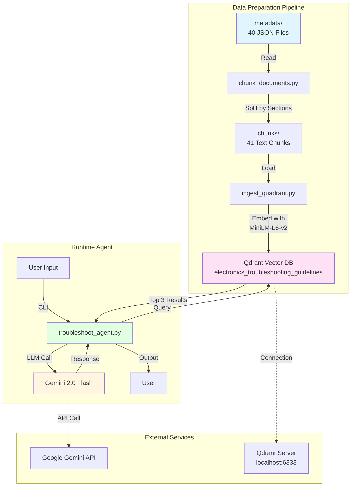
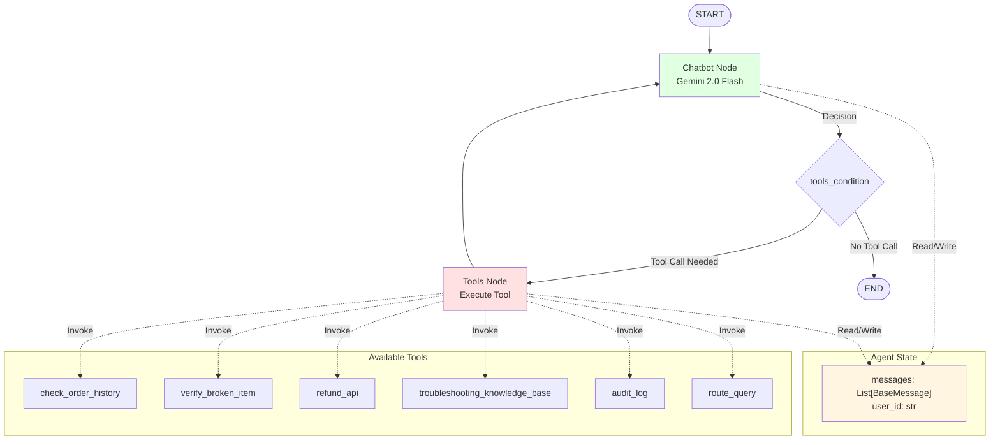
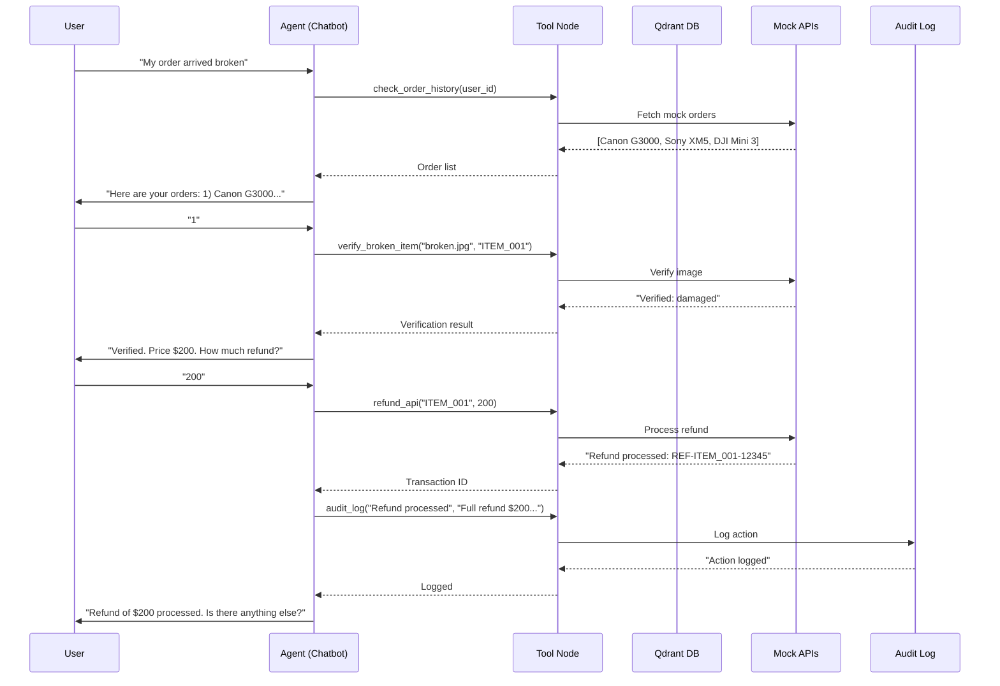
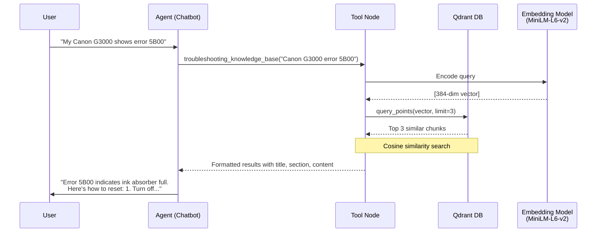
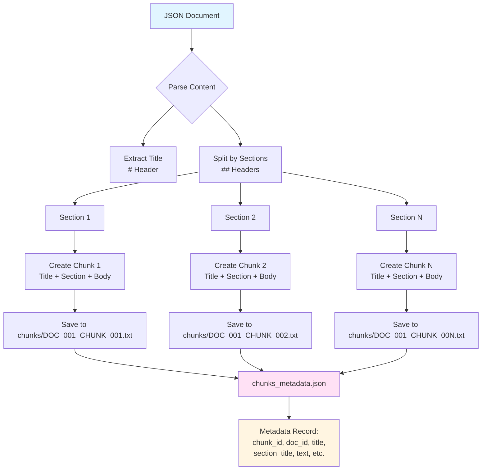
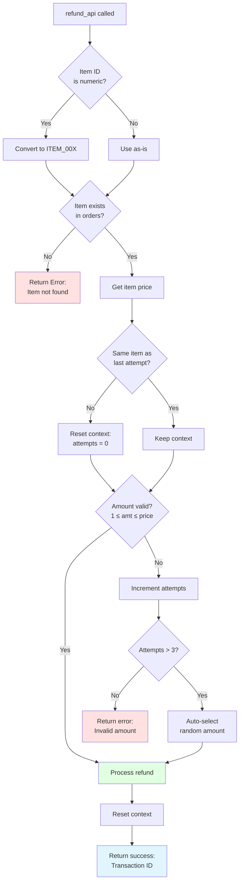
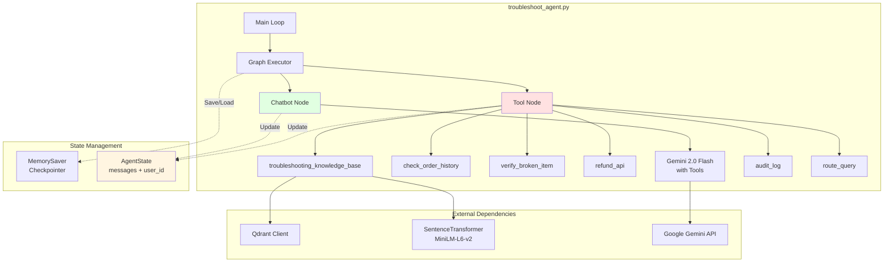
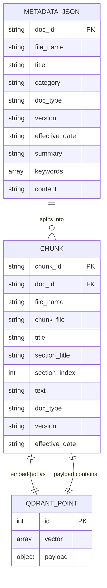
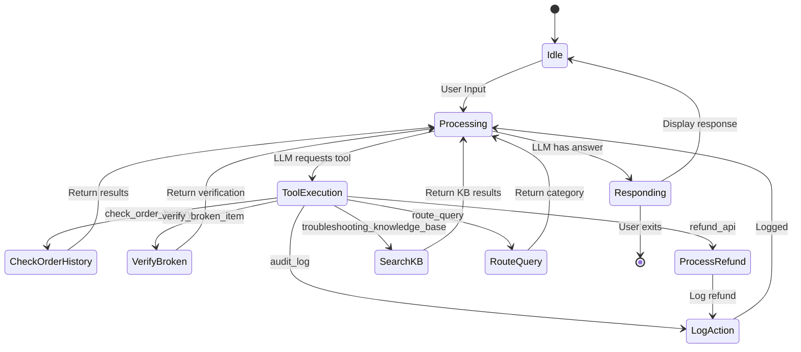

# Architecture Diagrams

This document contains Mermaid diagrams illustrating the system architecture.

## System Overview

## LangGraph Agent Flow

## Tool Interaction Flow

## Troubleshooting Query Flow

## Data Chunking Process

## Refund Validation Logic

## Component Architecture

## Knowledge Base Schema

## Conversation State Machine

